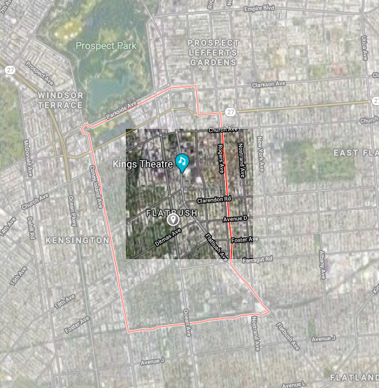
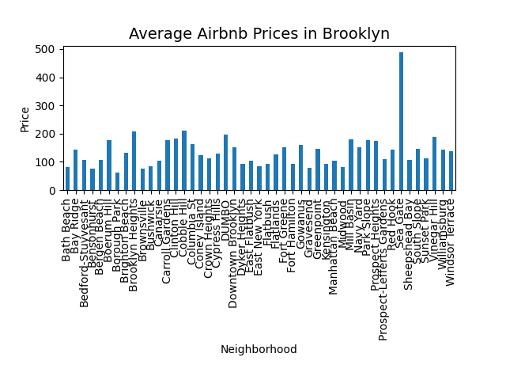
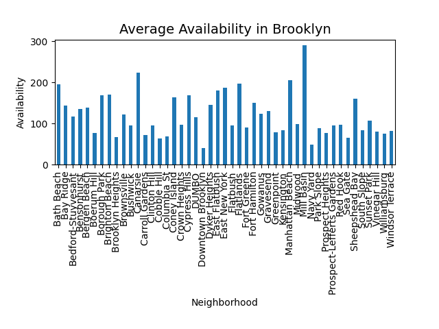
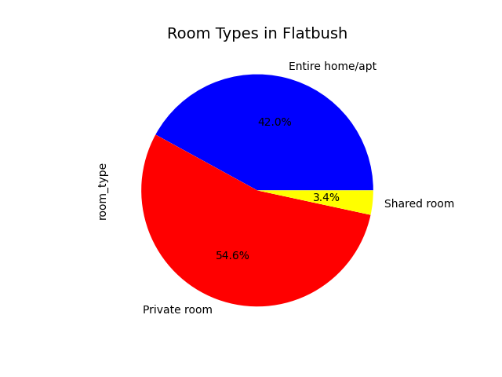
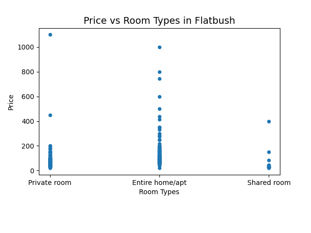

## Map
  

## Demographics

Zip Codes: Primarily 11226, but also: 11203, 11210, 11225  

Population: 100,277  

Median age: 34.7  

55% Female, 45% Male  

Median Household Income: $50,052  

## Important Qualities in a Neighborhood  

Some qualities that make a neighborhood desirable include: safety, public schools, jobs, ease of transportation, nightlife, recreation, diversity, and affordability. The three most important qualities when choosing where to rent a room or apartment are **safety, ease of transportation, and recreation.** Since most people book an Airbnb for a short period of time, the qualities that are important differ from those for a long-term stay. For example, affordability, quality of public schools, and jobs (all of which are mentioned on Niche) are not as important. However, safety, transportation, and recreation are integral for a good Airbnb experience. Transportation especially is important in a city like New York and a borough like Brooklyn, as people often want to travel to Manhattan.

## Rankings  

* StreetAdvisor: 8/10, #6 in Brooklyn
* Brick: #2/10
* DNAInfo: #40/69 (East Flatbush)
* Niche: B+, #95 in NYC  

## Airbnbs
<dl>
<iframe src="FlatbushAirbnbs.html" width="600" height="400" frameborder="0" frameborder="0" marginwidth="0" marginheight="0" allowfullscreen></iframe>
</dl>

There are 621 Airbnb listings in Flatbush. Compared to the total number of listings in Brooklyn, which is 20104, this is a very small percentage.  

  

Compared to other neighborhoods in Brooklyn, Flatbush is an affordable and popular area to rent Airbnbs. The average price of an Airbnb is approximately $92.21, with a minimum of $20 and a maximum of $1100, a very large range. The availability graph shows that Airbnbs in Flatbush have less availability compared to other Brooklyn neighborhoods, indicating that Airbnbs are in high demand here.
  
  

Most of the Airbnb options in Flatbush are private rooms, but entire homes/apartments are common as well.  
  

Out of the Airbnb room types, the most expensive is entire homes/apartments.
  

Generally, the Airbnbs found in Flatbush are affordable, in high demand, and most likely a private room.

